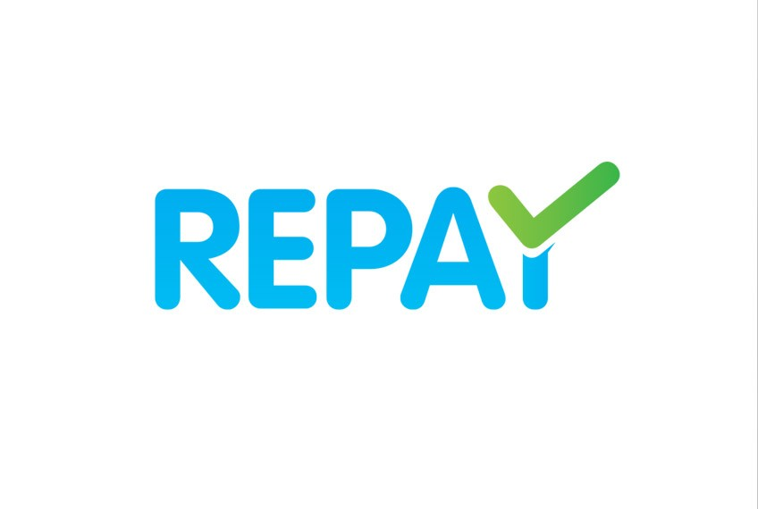

# LENDER
## Predicting whether a borrower is capable of repaying a loan :moneybag::dollar::bank:

In this demo I will use TensorFlow to build a model that will attempt to predict whether someone will be able to pay back their loan based on historical data. 

### Dataset

The dataset I will use is LendingClub dataset (from Kaggle). LendingClub is a US lending company, that gives out loans to people and then they have to pay back that loan with a certain interest rate. Sometimes, people won't pay off that loan, and the company is going to have to record that as what's known as a “charge_off”. Essentially they have to write off the loan because it wasn't paid back to them.

### Goal
The “loan_status” column will contain our label. We're going to try to predict, based off historical data and the features of a potential borrower, whether or not they will default on the loan. So, customer either will default (i.e. “charge_off”) or they will fully pay back the loan (i.e. “fully_paid).

### Steps
I will go through different steps required to build a model that meets required goal above. The steps will include the following: 
1. Exploratory data analysis
1. Dealing with missing data
1. Dealing with categorical data
1. Data preprocessing
1. Creating and training the model
1. Model evaluation

